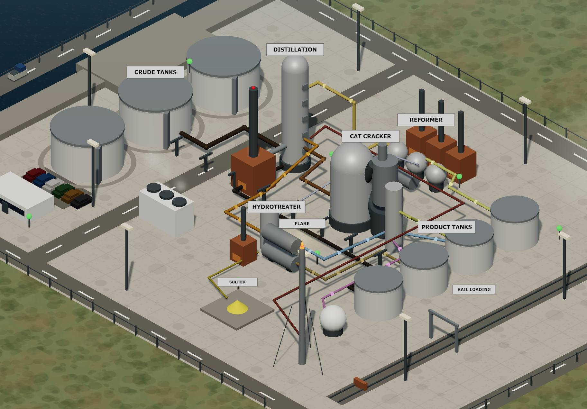
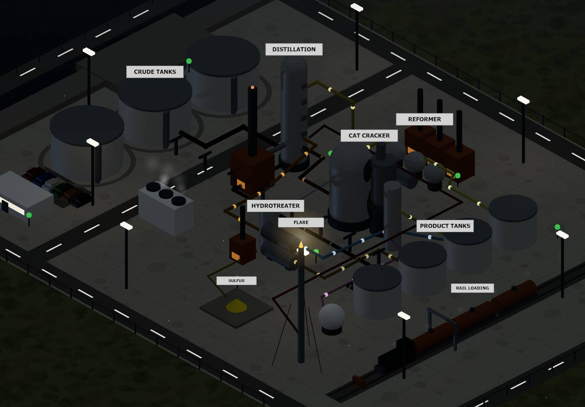

# Fable Refinery

Run — or wreck — a 1992 oil refinery.

**Play it: https://simrefinery.netlify.app**

In 1992, Chevron paid Maxis $75,000 for *SimRefinery*: a SimCity-style training
prototype that taught staff at the Richmond, California refinery how the plant
worked as a system — not by lecturing, but by letting them turn the knobs and
watch the consequences propagate. Some instructors opened training by asking
students to wreck the plant and get fired, because breaking the refinery
taught how its parts depended on each other. The software is lost.

Fable Refinery is a reconstruction inspired by that game, built from the
historical record — primarily Phil Salvador's history
["When SimCity got serious"](https://obscuritory.com/sim/when-simcity-got-serious/)
(The Obscuritory, 2020) and Esther Dyson's 1993 Forbes description of play —
and from the three surviving screenshots. It is not the original program and
is not affiliated with Maxis, Electronic Arts, or Chevron.

## What you do

- **Run the plant.** Choose a crude slate (light sweet, medium, heavy sour),
  set the feed rate, move three distillation cutpoints (as temperatures, like
  the original), set reformer and cat-cracker severity, and a maintenance
  budget. Products sell daily at drifting, seasonal prices; books settle
  weekly.
- **Live with the physics.** Worn units lose effective capacity; pushing feed
  past capacity builds pressure; the flare is the warning; past the red line a
  unit explodes, with an incident report naming the contributing factors. Two
  explosions or −$20M and you're fired.
- **See the system.** The left palette highlights any product stream through
  the 3D plant, the original's trick for showing how units feed each other.
  The reformer's byproduct hydrogen quietly gates the hydrotreater; a missed
  tanker drains the crude tanks; a breakdown mid-contract costs you penalties.
- **Build.** SimCity-style free placement: additional process units, crude
  tanks, a second flare, roads, trees, offices. Industrial structures need
  road access and pay a pipe tie-in by distance; the concrete and the
  perimeter fence grow with the plant. There's a bulldozer. No refunds.
- **Learn the trade.** A guided Operator Training mode checks ten hands-on
  tasks against the live simulation. Supply contracts offer fixed prices with
  shortfall penalties. Quarterly reviews grade you. The game does not come to
  a conclusion; you just keep trying to get better from period to period.
- **Or wreck it.** The "Wreck the Refinery" scenario is the instructors'
  exercise, preserved.

## Running locally

It's a single `index.html` (three.js from CDN, no build step).

- Windows: double-click `start.bat` (serves on `localhost:8917` and opens it),
- or any static server: `python -m http.server 8917`,
- or just open `index.html` in a browser.

Saves live in your browser's localStorage.

## Development

- `balance-sim.js` — a headless Node harness that runs the economy under ten
  strategies (hands-off, skilled, neglect, wreck, builder, contract-taker…).
  Every gameplay change was tuned and validated here first:
  `node balance-sim.js`. Its sim core is copy-shared with `index.html`; keep
  them in sync.
- `DESIGN.md` — the design history, version by version.
- In the browser console, `window.SIM` exposes the live state and drivers
  (`SIM.doTick()`, `SIM.placeItem(...)`, `SIM.snap()` for screenshots).

## Sources

- Phil Salvador, ["When SimCity got serious: the story of Maxis Business
  Simulations and SimRefinery"](https://obscuritory.com/sim/when-simcity-got-serious/),
  The Obscuritory, May 2020.
- Esther Dyson, "Cybersights for sore eyes," Forbes, 1993.

*SimRefinery* and *SimCity* are trademarks of their respective owners. This
project is a fan reconstruction for historical and educational interest.
